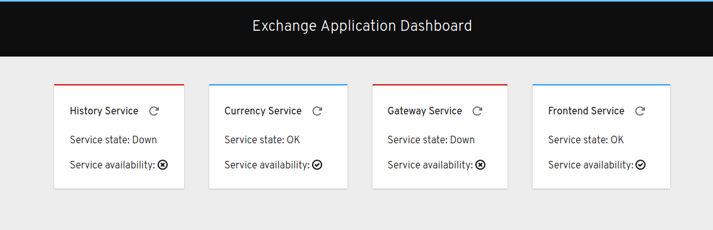

# Dashboard

This application serves as a quick visual check of connectivity of
services. The backend executes a request to the following services:

- History
- Currency
- Exchange
- Frontend (currency exchange frontend)



Requests are executed using full service FQDN, e.g. `http://${HISTORY_SERVICE}.${TARGET_PROJECT}.svc.cluster.local:${HISTORY_SERVICE_PORT}`.
You can change the parameters using the template parameters.

The dashboard frontend service communicates with the dashboard backend service (via ingress, such as the `istio-ingressgateway` pod).
Availability of the services is propagated into the frontend.

## Deployment

Note that if the exchange application is managed by Istio service mesh, this dashboard
application also has to be within the Service Mesh if you use any security features such as
mTLS, or authorization policies.

To deploy this application, execute:

```sh
oc process -o yaml -f kubefiles/template.yml \
     -p INGRESS_GW=ingress-gateway.istio-system-app.apps.example.com \
     -p TARGET_PROJECT=secure-mesh \
     | oc create -f
```
