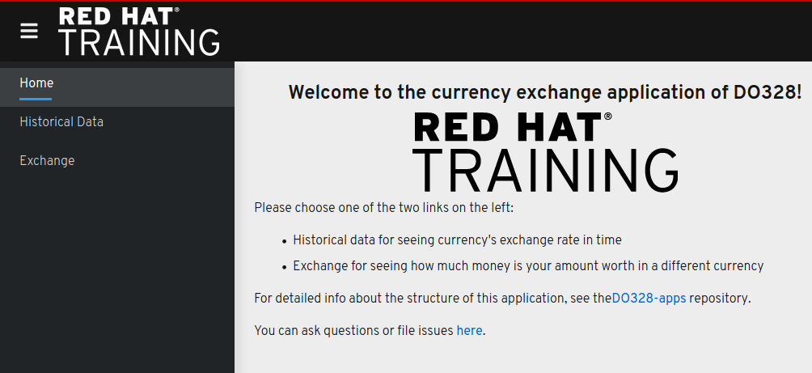

# Currency Exchange application

This application serves as an example of multi-service application. It consists of the following services:

- History
- Currency
- Exchange (Gateway)
- Frontend




## Deployment

Note that this application template is written for OpenShift Service Mesh.
The project where you deploy this application should be managed by OSSM
(i.e. be in the ServiceMeshMemberRoll resource).

If you want to use the news endpoint, provide the `NEWS_ENABLED`
variable in the template.

Also note there is no `http://` in the `INGRESS_GW` parameter. Protocol
is added by the frontend application.

To deploy this application, execute:

```sh
oc process -o yaml -f kubefiles/app-template.yml \
     -p INGRESS_GW=ingress-gateway.istio-system-app.apps.example.com \
     -p NEWS_ENDPOINT=url \
     | oc create -f -
```
